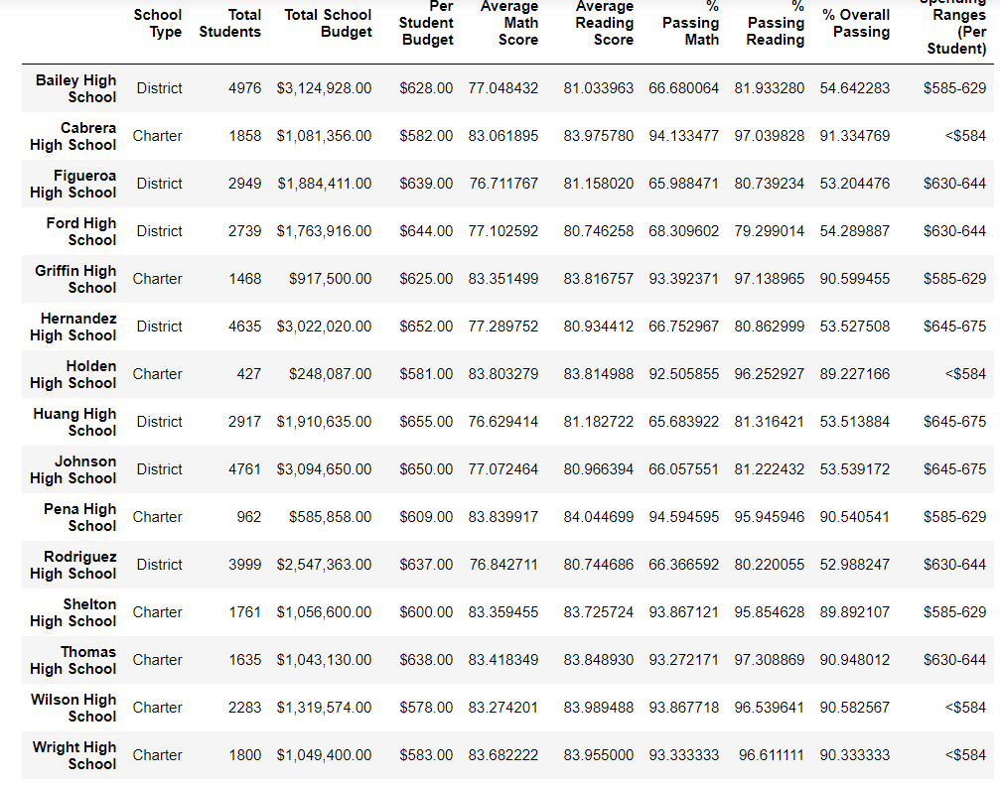

# School District Analysis

## Overview

### Purpose
The purpose of this Analysis is to check the math and reading grades for academic dishonesty by Analyzing the information without includeing the 9th grade class of Thamas High School. 

## Results

district summary before

district summary after

school summary before editing out 9th graders

school summary after editing out 9th graders

top schools before

top schools after

- 
-
-
-
-
-
-

## Summary
The overall numbers of Thomas High School have only changed slightly. a summary of schanges from the school summary are listed below:
- The average math score has changed slightly from 83.42 to 83.36
- The average Reading Score has changed from 83.85 to 83.90 
- The % Passing Math score changed from 93.87 to 93.19
- The % Passing Reading score has changed from 96.54 to 97.02
- The $ Overall Passing has changed from 90.95 to 90.63

